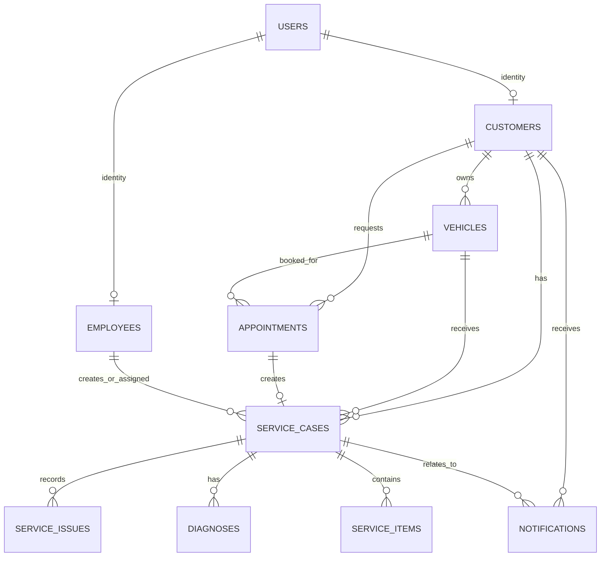

# Database design

`service_cases` remains the workflow aggregate. Existing `diagnoses`, `service_issues`, and `service_items` tables are reused for Phases 6 and 7; no new table or migration is needed.

Phase 2 stores PostgreSQL schema changes in Flyway. `V1__create_autocare_domain_schema.sql` creates `users`, `customers`, `employees`, `vehicles`, `appointments`, `service_cases`, `service_issues`, `diagnoses`, `service_items`, and `notifications`.

Phase 4 adds `customer_business_id_seq` and `vehicle_business_id_seq` in V3. The application uses them for stable public IDs (`CUS-000001` and `VEH-000001`) independent of internal database primary keys.

Every table uses a generated `BIGINT` primary key. Public-facing identifiers are separate unique business fields: `CUS-*`, `EMP-*`, `VEH-*`, `APT-*`, `SRV-*`, and `NTF-*`. Their generation is deliberately deferred to a later business-service phase, so clients never choose the final identifier.

`User` is a future authentication anchor. Its optional `password_hash` must contain a hash when local authentication is introduced; no password is logged or authenticated in Phase 2. Customers and employees optionally link one-to-one to a user. Vehicles, appointments, and service cases respectively attach to customers and vehicles. A service case has at most one originating appointment. Issues, diagnoses, service items, and notifications link to the case as applicable. The mappings are intentionally unidirectional, keeping persistence simple and avoiding accidental recursive JSON serialization.

Required columns include customer name/phone; vehicle make/model/color/license plate; appointment customer/vehicle/date/time/service type/status; and service-case customer/vehicle/visit type/service type/priority/status. Business IDs and license plates are unique. Targeted indexes support identifiers, license plate, status, and priority.

Do not modify an already-applied migration. Add a new sequential migration for each schema change and retain `spring.jpa.hibernate.ddl-auto=validate` for PostgreSQL environments.
